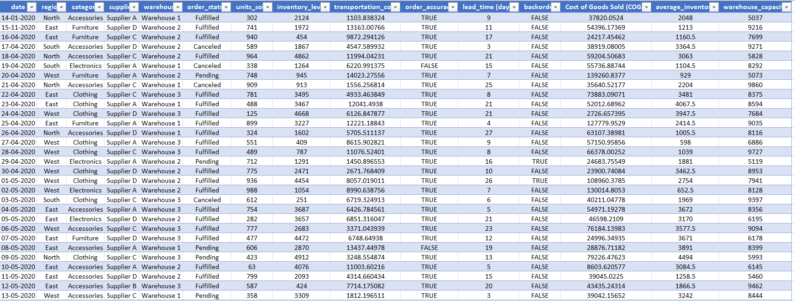
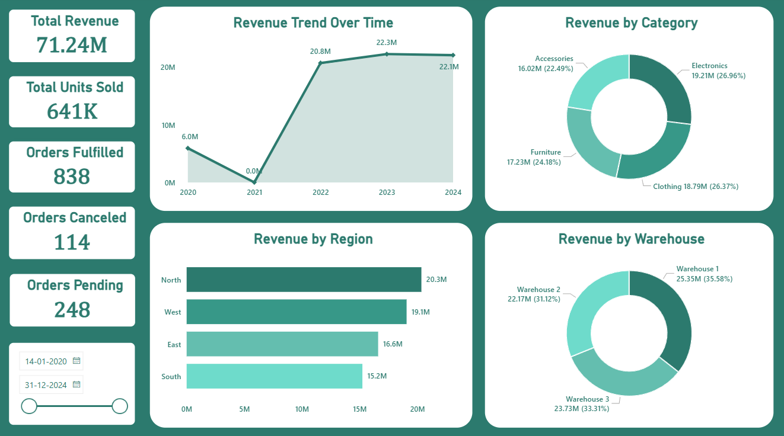
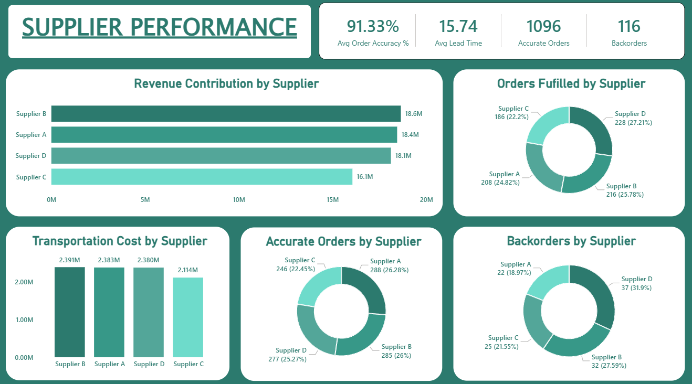
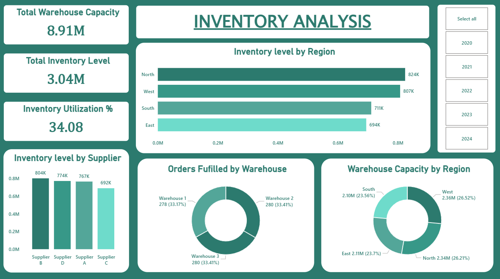
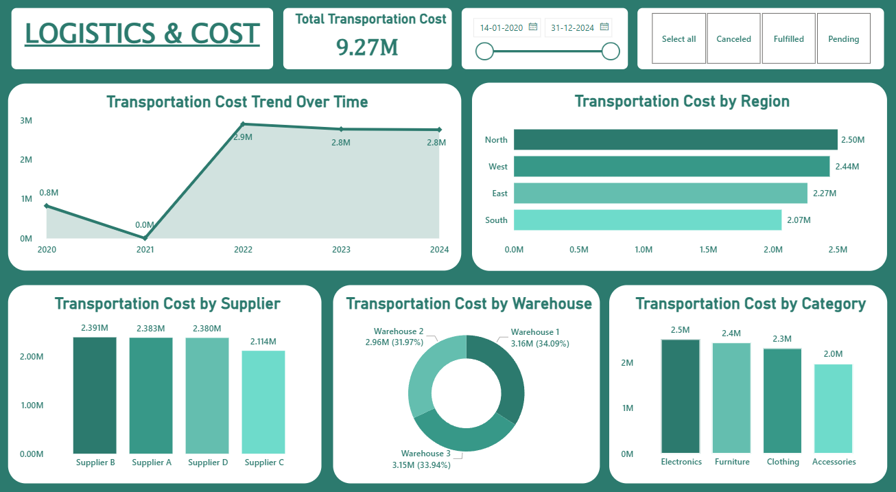

# Supply Chain Efficiency & Delivery Performance Analysis

## Project Overview

This project analyzes end-to-end supply chain operations to identify inefficiencies in inventory management, supplier performance, and logistics cost.

Using SQL for data analysis and Power BI for visualization, the project highlights key operational challenges and provides actionable insights to improve efficiency, reduce costs, and enhance overall supply chain performance.

---

## Business Context

In modern supply chain operations, businesses face challenges such as delivery delays, excess inventory, high transportation costs, and supplier inefficiencies.

Without proper analysis, these issues lead to increased operational costs, poor customer satisfaction, and lost revenue opportunities.

This project simulates a real-world business scenario where data-driven insights are used to optimize supply chain performance.

---

## Business Objectives

- Analyze overall business performance and revenue trends
- Evaluate supplier efficiency and reliability
- Identify inventory utilization and stock inefficiencies
- Assess logistics and transportation cost distribution
- Detect operational bottlenecks such as backorders
- Provide actionable recommendations to improve supply chain efficiency

---

## Dataset Preview

The dataset contains supply chain operational data including orders, inventory levels, suppliers, warehouses, and logistics costs across multiple regions and time periods.

## Dataset Information

| Column Name           | Data Type | Description                                      | Business Relevance |
|----------------------|----------|--------------------------------------------------|--------------------|
| order_date           | Date     | Date when the order was placed                   | Used for trend analysis and time-based insights |
| region               | String   | Geographic region of the order                   | Helps identify high-performing markets |
| category             | String   | Product category                                | Used to analyze product-level performance |
| supplier             | String   | Supplier fulfilling the order                    | Evaluates supplier performance and reliability |
| warehouse            | String   | Warehouse handling the order                     | Helps assess warehouse efficiency |
| order_status         | String   | Status (Fulfilled, Pending, Canceled)            | Tracks fulfillment efficiency and operational gaps |
| units_sold           | Integer  | Number of units sold                             | Measures demand and sales volume |
| inventory_level      | Integer  | Current inventory level                          | Helps monitor stock availability |
| transportation_cost  | Decimal  | Cost incurred for logistics                      | Key metric for cost and profitability analysis |
| order_accuracy       | Boolean  | Indicates whether the order was accurate         | Measures operational accuracy and service quality |
| lead_time_days       | Integer  | Delivery lead time in days                       | Evaluates supplier and logistics efficiency |
| backorder            | Boolean  | Indicates whether the order was backordered      | Tracks supply shortages and demand mismatch |
| cogs                 | Decimal  | Cost of goods sold                              | Core metric for cost and profitability analysis |
| avg_inventory        | Decimal  | Average inventory maintained                     | Used to evaluate inventory efficiency |
| warehouse_capacity   | Integer  | Maximum storage capacity of warehouse            | Helps assess utilization and capacity planning |

---

## DAX Calculations

- Total Revenue = SUM(inventory_operations[Cost of Goods Sold (COGS)])

- Total Units Sold = SUM(inventory_operations[units_sold])

- Orders Fufilled = 
CALCULATE(
    COUNTROWS(inventory_operations),
    inventory_operations[order_status] = "Fulfilled"
)

- Orders Canceled = 
CALCULATE(
    COUNTROWS(inventory_operations),
    inventory_operations[order_status] = "canceled"
)

- Orders Pending = 
CALCULATE(
    COUNTROWS(inventory_operations),
    inventory_operations[order_status] = "pending"
)

- Avg Order Accuracy % = 
AVERAGEX(
    inventory_operations,
    IF(inventory_operations[order_accuracy] = TRUE(), 1, 0)
)

- Avg Lead Time = AVERAGE(inventory_operations[lead_time (days)])

- Accurate Orders = 
CALCULATE(
    COUNTROWS(inventory_operations),
    inventory_operations[order_accuracy] = TRUE()
)

- Backorders = 
CALCULATE(
    COUNTROWS(inventory_operations),
    inventory_operations[backorder] = TRUE()
)

- Inventory Utilization % = 
DIVIDE(
    AVERAGE(inventory_operations[inventory_level]),
    AVERAGE(inventory_operations[warehouse_capacity])
) * 100

---

# SQL Analysis

**1. Overall Sales Performance**

Business Question: What is the overall sales performance in terms of revenue and units sold?

Total units sold: 640671
Total revenue generated: 71244576.02092892

Key Insight: The business shows strong overall sales performance, indicating consistent demand across the supply chain.

Business Recommendation: Focus on scaling high-performing segments to further increase revenue and market reach.

---

**2. Region-wise Performance**

Business Question: Which regions contribute the most to overall revenue?

Region  | Tottal units | Revenue
North   | 170175       | 20347653.809619017

Key Insight: North region contribute a major share of total revenue, indicating geographical concentration of demand.

Business Recommendation: Strengthen operations in high-performing regions while improving strategies in low-performing areas.

---

**3. Category-wise Sales**

Business Question: Which product categories drive sales?

Key Insight: Revenue is relatively distributed across categories, with Electronis categories slightly outperforming others.

Business Recommendation: Promote high-performing categories and optimize inventory for low-performing ones.

---

**4. Supplier Performance (Sales Contribution)**

Business Question: Which suppliers contribute the most to total sales?

Key Insight: Supplier contribution is balanced, reducing dependency risk on a single supplier. Supplier B contribute the most to total sales

Business Recommendation: Maintain strong relationships with top-performing suppliers while evaluating underperformers.

---

**5. Order Status Distribution**

Business Question: What is the distribution of orders status?

Key Insight: While most orders are fulfilled, a noticeable portion remains pending or canceled, indicating process inefficiencies.

Business Recommendation: Improve order processing and fulfillment systems to reduce pending and canceled orders.

---

**6. Average Lead Time by Supplier**

Business Question: Which suppliers have the highest delivery lead time?

Key Insight: Supplier B have longer lead times, impacting overall delivery efficiency.

Business Recommendation: Prioritize faster suppliers and work with slow suppliers to improve delivery timelines.

---

**7. Inventory Utilization**

Business Question: How efficiently are warehouses utilizing their capacity?

Key Insight: Warehouse capacity is underutilized, indicating inefficient inventory distribution.

Business Recommendation: Optimize inventory allocation to improve utilization and reduce storage costs.

---

**8. Overstock vs Understock**

Business Question: Which product categories are overstocked or understocked?

Key Insight: Certain categories hold excess inventory, increasing holding costs and risk of inefficiency.

Business Recommendation: Align inventory levels with demand to reduce overstocking and avoid stockouts.

---

**9. Transportation Cost Analysis**

Business Question: Which regions incur the highest transportation costs?

Key Insight: Transportation costs are concentrated in certain regions, increasing overall operational expenses. North region incur the highest transportation costs

Business Recommendation: Optimize logistics routes and distribution strategies to reduce transportation costs.

---

**10. Cost Efficiency**

Business Question: What is the cost efficiency across product categories?

Key Insight: Some categories have higher cost per unit, affecting profitability.

Business Recommendation: Focus on cost optimization and pricing strategies for high-cost categories.

---

**11. Yearly Trend Analysis**

Business Question: How does sales performance vary over time?

Key Insight: Sales fluctuate across years, indicating seasonal demand patterns. 

Business Recommendation: Plan inventory and logistics based on demand trends to improve efficiency.

---

**12. Warehouse Performance**

Business Question: Which warehouses perform best in terms of delivery efficiency?

Key Insight: Warehouse performance is relatively balanced, but some variations exist in delivery efficiency.

Business Recommendation: Standardize best practices across warehouses to improve overall efficiency.

---

## Business Performance Overview

## Key Performance Indicators

- Total revenue - 71.24M
- Total units sold - 641K
- Orders fulfilled - 838
- Orders cancelled - 114
- Orders pending - 248

## Dashboard Features

- High-level KPI summary (Revenue, Units Sold, Orders) 
- Revenue trend analysis 
- Regional performance comparison 
- Category-wise revenue contribution
- Revenue Contribution by warehouse
- Interactive date filter

## Business Questions

- What is the overall business performance? 
- How has revenue changed over time? 
- Which regions contribute the most to revenue? 
- Which product categories drive the most revenue?
- Which warehouse contribute the most to revenue?

## Key Insights 

- 70% of orders are fulfilled, but 30% (pending + canceled) indicates operational gaps.
- Revenue peaked in 2022–2023, indicating strong demand growth, followed by fluctuations. 
- North and West regions are the top contributors (20.2M & 19M each), showing strong regional dominance.  
- Revenue is evenly distributed across categories, but Electronics slightly leads. 
- Warehouse 1 is the top contributor with 25.11M, which is 35.5% of the total revenue.

## Business Recommendations

- Improve order fulfillment processes by reducing pending and canceled orders through better inventory planning and faster order processing.
- Analyze the factors behind the post-2023 fluctuation and implement demand forecasting and seasonal planning to stabilize revenue growth.
- Scale operations in North and West regions to maximize revenue, while investing in underperforming regions to balance geographic dependence.
- Increase focus on high-performing categories like Electronics while optimizing pricing, promotion, or inventory strategies for lower-performing categories.
- Leverage best practices from Warehouse 1 to improve performance across other warehouses and optimize inventory distribution to reduce dependency on a single warehouse.

---

## Supplier Performance

## Key Performance Indicators

- Avg order accuracy% - 91.33%
- Avg lead time - 15.74 days
- Accurate orders - 1096
- Backorders - 116

## Dashboard Features

- Supplier-wise revenue contribution 
- Transportation cost comparison 
- Order fulfillment distribution 
- Backorder analysis 
- Order accuracy tracking
  

## Business Questions

- Which suppliers contribute the most to revenue?
- Which suppliers have the highest Transportation cost? 
- What facor is causing delays or inefficiencies? 
- How accurate are supplier deliveries? 
- Which suppliers generate the most backorders?
- Which suppliers contribute the most to successfully fulfilled orders?
- Which suppliers maintain the highest order accuracy? 

## Key Insights

- Revenue contribution is evenly distributed across suppliers, reducing dependency risk. 
- Supplier B, A and C incur the highest transportation costs, impacting profitability.  
- Lead time (15.74 days avg) suggests moderate delivery delays across suppliers. 
- Order accuracy is relatively high (91.33%), but still leaves room for improvement.
- Supplier D has the highest backorders (31.9%), indicating supply issues.
- Supplier D has most fulfilled orders with (27.21%), indicating dependency on specific suppliers for successful operations.
- Supplier A maintain the highest order accuracy but certain suppliers show lower accuracy levels, indicating quality or process gaps in order handling

## Business Recommendations

- Maintain a diversified supplier base to reduce dependency risk, while identifying opportunities to scale high-performing suppliers for better revenue growth.
- Re-evaluate contracts and logistics strategies for high-cost suppliers (Supplier B, A & C) to reduce transportation expenses and improve profitability.
- Optimize supplier lead times by improving coordination, and prioritizing suppliers with faster delivery performance.
- Implement standardized quality checks and monitoring systems to improve overall accuracy and minimize operational errors.
- Address supply gaps with Supplier D by improving demand forecasting, inventory planning, or considering alternative suppliers to reduce backorders.
- Reduce dependency on Supplier D by distributing order volumes more evenly across suppliers to minimize operational risk.
- Leverage best practices from Supplier A and apply them across other suppliers to improve consistency and overall delivery quality.

  
---

## Inventory Analysis

## Key Performance Indicators

- Total warehouse capacity - 8.91M
- Total inventory level - 3.04M
- Inventory Utilization% - 34.08%

## Dashboard Features

- Inventory levels across regions
- Inventory levels across suppliers
- Warehouse capacity comparison 
- Warehouse-level order fulfillment 
- Year-wise filtering capability

## Business Questions

- Are warehouses being efficiently utilized? 
- Which regions hold the most inventory? 
- Is there overstocking or underutilization? 
- How is inventory distributed across suppliers? 
- Which warehouses perform best operationally?

## Key Insights

- Total inventory (3.04M) vs capacity (8.91M) only 34.08% utilization, indicating underutilization. 
- North and West regions hold the highest inventory levels.
- Significant unused capacity suggests inefficiency in inventory planning.
- Inventory distribution across suppliers is relatively balanced. 
- Warehouse performance is evenly distributed across all 3 warehouses.

## Business Recommendations

- Optimize inventory allocation across warehouses to improve utilization and reduce idle capacity, lowering storage and operational costs.
- Rebalance inventory from high-stock regions (North & West) to lower-demand regions to improve distribution efficiency and reduce holding costs.
- Implement demand-driven inventory planning and forecasting models to avoid excess stock and improve overall inventory efficiency.
- Maintain balanced supplier distribution while continuously monitoring supplier performance to prevent future supply concentration risks.
- Standardize operational processes across all warehouses and introduce performance benchmarks to further improve efficiency and scalability.

---

## Logistics & Cost

## Key Performance Indicator

- Total transportation cost - 9.27M
   

## Dashboard Features
 
- Transportation cost trend 
- Region-wise logistics cost analysis 
- Supplier-wise logistics cost comparison 
- Transportation cost distribution by Warehouse
- Category-level transportation cost 

## Business Questions

- How has transportation cost changed over time? 
- How are transportation costs distributed across regions? 
- Which suppliers incur the highest logistics costs? 
- Which warehouses are cost-intensive? 
- Which product categories drive logistics costs?

## Key Insights

- Transportation costs have increased from 2022, indicating rising logistics expenses and potential inefficiencies, and it also has impact on the revenue. 
- A few regions (North and West) contribute the majority of transportation costs, aligning with high sales activity.
- Supplier B and A incur the highest logistics costs, making them the most expensive suppliers to operate with. 
- Transportation costs are relatively evenly distributed across warehouses, with slight variations indicating minor efficiency differences.
- Certain product categories (e.g., Electronics) drive higher transportation costs due to higher volume or delivery requirements. 

## Business Recommendations

- Implement cost control strategies such as route optimization and bulk shipping to manage rising transportation expenses.
- Optimize regional distribution networks by relocating inventory closer to demand centers to reduce shipping distance and cost.
- Re-negotiate contracts or evaluate alternative suppliers to reduce high logistics costs associated with Supplier B and A.
- Identify and replicate best practices from more efficient warehouses to minimize cost variations and improve overall logistics efficiency.
- Optimize packaging, shipping methods, and inventory placement for high-cost categories to reduce transportation expenses.

  
---

## Tools Used

- Excel – Data cleaning and preprocessing
- SQL (MySQL) – Data extraction and analysis
- Power BI – Data visualization and dashboard creation

---

## Skills Demonstrated

- Data cleaning and preprocessing
- Business problem solving
- Dashboard design and visualization
- Insight generation and storytelling

---

## SQL Skills Demonstrated
- Aggregations (SUM, AVG, COUNT)
- Grouping and filtering (GROUP BY, HAVING)
- Business-driven query design
- Performance-focused data analysis

---

## Data Workflow

1. Raw dataset collected and cleaned in Excel
2. Data imported into SQL database
3. SQL queries used to analyze business problems
4. Interactive dashboards created for visualization
5. Insights and recommendations derived from analysis

---

## Project Structure

supply-chain-performance-analysis-sql-powerbi/
│
├── dataset/
│   └── supply_chain_dataset.xlsx
│
├── sql/
│   └── supply_chain_analysis_queries.sql
│
├── powerbi/
│   └── supply_chain_dashboard.pbix
│
├── images/
│   ├── dataset_preview.png
│   ├── business_performance_dashboard_overview.png
│   ├── supplier_analysis.png
│   ├── inventory_analysis.png
│   └── logistics_analysis.png
│
└── README.md

---

## Repository Structure

**dataset** - supply_chain_dataset.xlsx  
Contains cleaned dataset used for supply chain analysis  

**sql** - supply_chain_analysis.sql  
Includes SQL queries for data exploration, KPI calculations, and business analysis  

**powerbi** - supply_chain_dashboard.pbix  
Contains the Power BI dashboard file with all visualizations  

**images** - dataset_preview.png, business_performance_dashboard_overview.png, supplier_analysis.png, inventory_analysis.png, logistics_analysis.png  
Stores dataset preview and dashboard screenshots used in the README  

**README.md**  
Complete project documentation including business context, SQL insights, dashboards, and recommendations  

---

## How to Use

1. Download the dataset from the /dataset folder
2. Import data into your SQL environment
3. Run queries from /sql/supply_chain_analysis_queries.sql
4. Open Power BI file to explore dashboards
5. Interact with filters to analyze different scenarios

---

## Conclusion

The analysis highlights key inefficiencies in supply chain operations, including supplier delays, underutilized warehouse capacity, and high transportation costs in certain regions.

By addressing these issues, businesses can improve operational efficiency, reduce costs, and enhance customer satisfaction.

This project demonstrates how data-driven decision-making can significantly optimize supply chain performance.

---

Author

Sarvesh Vernekar

Aspiring Data Analyst focused on transforming business data into actionable insights through analytics, visualization, and data-driven decision making.
